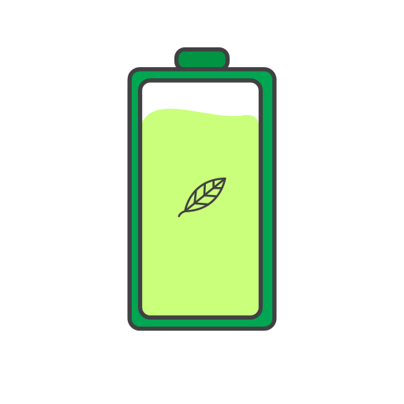

# Watchcharge

## What is WATchcharge app?

The WATchcharge app is a part of dedicated software for the user of the WATchcharge I or WATchcharge II charger. Its task is to develop appropriate charging habits for the user of WATchcharge charger, which is achieved by displaying usable tips at the bottom of the screen. The application also presents detailed information about parameters and condition of our cell. It can also motivate the user to move outside because its exactly when the charger generates energy the most effectively.

---

The application has a dedicated dark mode and it’s available in three linguistic versions: Polish, English and Ukrainian. The language of our eastern neighbours has been added due to the war initiated by Russia against the independent Ukraine. WATchcharge responds to the needs of every user and actively reacts to the changeable global situation – it is irreplaceable source of additional energy in crisis situations, when every percent of our battery life may affect on our health or even life. 

> In this way, I want to express my support for the bravely defending people of Ukraine.

---

## Dependencies

Application uses the following element from an **open-source** project:

- [Progress bar](https://github.com/john990/WaveView)